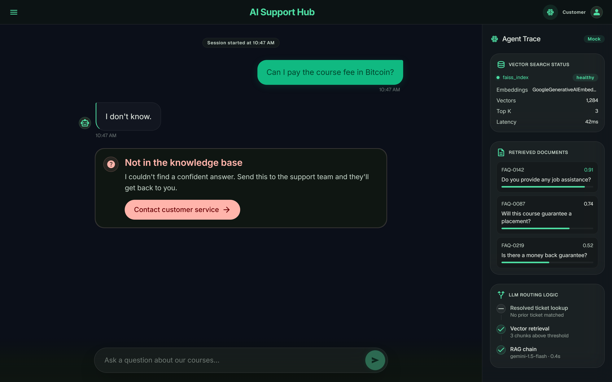
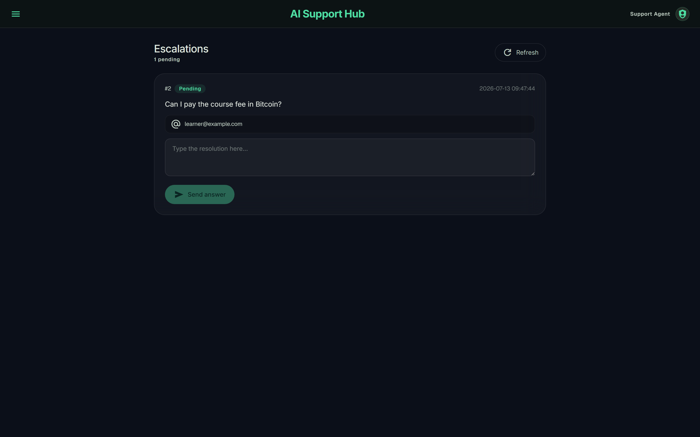

# Agentic FAQ Support Pipeline

[](https://github.com/mithun2244/Agentic-FAQ-Support-Pipeline/actions/workflows/pylint.yml)

An end-to-end LLM project that answers user FAQs from a company knowledge base using a Retrieval-Augmented Generation (RAG) architecture powered by **NVIDIA NIM** endpoints. The system exposes a Streamlit interface where users can ask questions and receive grounded answers sourced directly from the FAQ dataset — with a human-in-the-loop fallback so nothing goes unanswered.

## 🎬 Demo

An unanswered question becomes a support ticket, an admin answers it from the portal, and the **next** student who asks gets that answer automatically — no LLM call needed.


## 🏗️ Architecture

Every question first checks the resolved-ticket store, then the RAG chain. If neither can answer, it escalates to a human — whose answer feeds back into the store so the next user is served instantly.

```
                          ┌───────────────────────────┐
   User question ───────► │ 1. Resolved-ticket lookup  │ ── match ──► Answer ✅
                          │    (SQLite, normalized)    │             (no LLM call)
                          └────────────┬──────────────┘
                                       │ no match
                                       ▼
                          ┌───────────────────────────┐
                          │ 2. RAG chain (NVIDIA NIM)  │
                          │  NVIDIAEmbeddings ─► FAISS  │ ── grounded ─► Answer ✅
                          │  retriever ─► ChatNVIDIA    │
                          │  (LLaMA 3.1 8B)            │
                          └────────────┬──────────────┘
                                       │ "I don't know"
                                       ▼
                          ┌───────────────────────────┐
                          │ 3. Human-in-the-loop        │
                          │  "Contact Customer Service" │
                          │  ─► Pending ticket (SQLite) │
                          └────────────┬──────────────┘
                                       │
                                       ▼
                          ┌───────────────────────────┐
                          │ 4. Admin Portal (sidebar)   │
                          │  answers ticket ─► Answered │──┐
                          └───────────────────────────┘  │
                                       ▲                  │ feeds back into
                                       └──────────────────┘ the ticket store (step 1)
```

### 💬 Conversational RAG with human-in-the-loop fallback



When the model can't answer from the knowledge base, it replies "I don't know" and offers a **📩 Contact Customer Service** button that files a support ticket instead of leaving the user stuck.

### 🛠️ Admin Portal



A password-protected **Admin Portal** in the sidebar lets support staff review pending tickets and respond. Once answered, the same question is resolved automatically from the ticket store for any future user — bypassing the LLM entirely.

## Project Highlights

- **NVIDIA NIM RAG architecture** — inference is served by NVIDIA NIM (NVIDIA Inference Microservices) hosted endpoints for low-latency, GPU-accelerated responses without managing any local model infrastructure.
- **LLM:** `meta/llama-3.1-8b-instruct` via `ChatNVIDIA` — a fast, instruction-tuned model well suited to grounded question answering.
- **Embeddings:** `nvidia/nv-embedqa-e5-v5` via `NVIDIAEmbeddings` — retrieval-optimized embeddings that keep answers tightly grounded in the source FAQs.
- **Vector store:** FAISS for fast local similarity search over the embedded knowledge base.
- **Grounded answers only** — the prompt constrains the model to answer strictly from retrieved context, returning "I don't know." when the answer isn't present, minimizing hallucinations.

## Tech Stack

- LangChain + NVIDIA NIM (`langchain-nvidia-ai-endpoints`): LLM + embeddings
- Streamlit: UI
- FAISS: Vector database

## Installation

1. Clone this repository to your local machine using:

```bash
  git clone https://github.com/mithun2244/Agentic-FAQ-Support-Pipeline.git
```

2. Navigate to the project directory:

```bash
  cd Agentic-FAQ-Support-Pipeline
```

3. Install the required dependencies using pip:

```bash
  pip install -r requirements.txt
```

4. Acquire an API key from [build.nvidia.com](https://build.nvidia.com) and put it in a `.env` file (see `.env.example`):

```bash
  NVIDIA_API_KEY="your_nvidia_api_key_here"
```

## Usage

1. Run the Streamlit app by executing:

```bash
streamlit run main.py
```

2. The web app will open in your browser.

- To create a knowledgebase of FAQs, click on the **Create Knowledgebase** button. It will take some time before the knowledgebase is created, so please wait.

- Once the knowledge base is created you will see a directory called `faiss_index` in your current folder.

- Now you are ready to ask questions. Type your question in the Question box and hit Enter.

## Sample Questions

- Do you guys provide internship and also do you offer EMI payments?
- Do you have javascript course?
- Should I learn power bi or tableau?
- I've a MAC computer. Can I use powerbi on it?
- I don't see power pivot. how can I enable it?

## Project Structure

- `main.py`: The main Streamlit application script (chat UI, fallback flow, admin portal).
- `langchain_helper.py`: LangChain + NVIDIA NIM code that builds the FAISS index and RetrievalQA chain.
- `db_helper.py`: SQLite manager for the human-in-the-loop `tickets` store.
- `requirements.txt`: A list of required Python packages for the project.
- `.env`: Configuration file for storing your NVIDIA API key (not committed — see `.env.example`).
